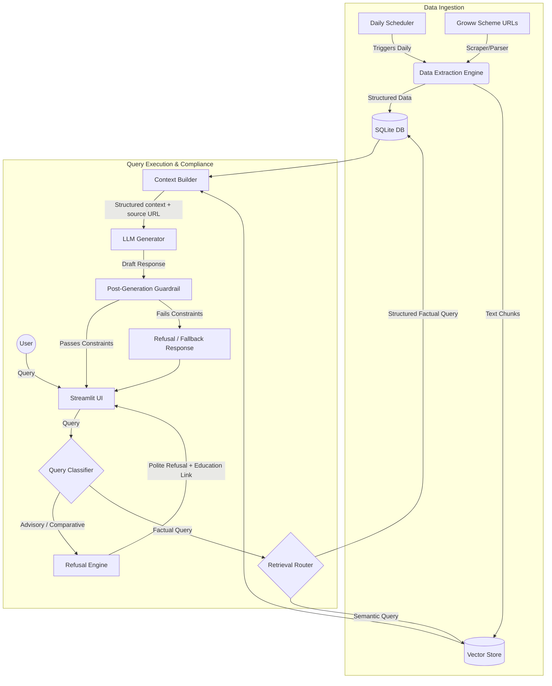

# System Architecture: Mutual Fund FAQ Assistant

This document outlines the design and architecture of the **Mutual Fund FAQ Assistant**. It details the end-to-end data flow, component responsibilities, RAG pipeline, and compliance guardrails designed to ensure facts-only responses.

---

## 1. High-Level Architecture Overview

The system is designed as a Retrieval-Augmented Generation (RAG) pipeline combined with structured metadata lookups. Since the core requirement is absolute factual accuracy and compliance (no advisory content), the architecture prioritizes structured parsing and post-generation verification.



---

## 2. Component Design & Breakdown

### 2.1 Data Ingestion & Parsing Layer
The system targets exactly **5 Groww URLs** for HDFC Mutual Fund schemes.
*   **Web Scraper**: Leverages `BeautifulSoup` or `Playwright` to extract details from the Javascript-rendered Groww scheme pages.
*   **Structured Parser**: Extracts key statistics and maps them into a relational schema:
    *   *Scheme Name, NAV, Expense Ratio, Exit Load, Minimum SIP, Riskometer, Benchmark, Launch Date.*
    *   *Fund Management Team:* Names, experience, tenure, and other funds managed.
*   **Text Chunker**: Splits textual fields (like scheme description, manager bio, exit load rules) into semantic chunks of ~300-500 characters with overlapping boundaries.
*   **Daily Scheduler**: A scheduled task (e.g., via a system cron job, GitHub Actions scheduler, or local scheduler library like `APScheduler` / `Celery`) that executes the ingestion workflow automatically on a daily basis to keep scheme facts (such as daily NAV, expense ratios, and fund management changes) up to date.

### 2.2 Storage Layer
*   **Relational DB (SQLite)**: Stores raw structured values for deterministic fact retrieval (e.g., asking for "What is the exit load of HDFC Small Cap?").
*   **Vector Database (ChromaDB / FAISS)**: Stores text chunk embeddings (generated using a lightweight local embedding model, e.g., `all-MiniLM-L6-v2`) to answer semantic questions (e.g., fund manager history, download processes).

### 2.3 Retrieval Layer (Hybrid Search)
*   **Router**: Determines if a query can be solved via structured SQLite query or semantic vector search.
*   **Context Builder**: Combines structured fields and text chunks into a unified context payload. Every retrieved item is strictly tagged with its corresponding source URL (from the 5 allowed URLs).

### 2.4 Orchestration & Compliance Layer (The Guardrails)
To prevent hallucinations and compliance breaches, the orchestration layer performs pre-processing and post-processing:

#### Pre-Processing (Query Classifier)
*   Analyzes the query using rule-based keyword matching and a lightweight classifier.
*   Queries containing advisory trigger words (e.g., *should I, best, invest, buy, recommend, better, performance comparison*) are routed directly to the **Refusal Engine**.

#### LLM Prompt Engineering (Groq / Gemini API)
*   **Context Injection**: Injects retrieved context along with strict system instructions.
*   **System Prompt Guidelines**:
    ```text
    You are a facts-only Mutual Fund FAQ Assistant.
    Answer the user's query using ONLY the verified facts in the context below.
    If the context does not contain the answer, politely state that you do not have that information.
    Do NOT give investment opinions, advice, or suggestions.
    Do NOT compare fund performances.
    Limit your response to a maximum of 3 sentences.
    Include exactly one source citation URL in your response.
    ```

#### Post-Processing (Guardrail Verifier)
*   **Sentence Counter**: Verifies that the LLM response contains $\le 3$ sentences.
*   **Link Validator**: Verifies that exactly one citation link exists and belongs to the set of 5 authorized Groww URLs.
*   **Safety Filter**: Confirms that no advisory or speculative phrases (e.g., "highly recommend", "good returns", "you should") slipped through.
*   If the guardrail fails, the system auto-rejects the LLM response and defaults to a safe fallback refusal: *"I can only provide factual details retrieved directly from our verified sources."*

### 2.5 Presentation Layer (UI)
*   A clean, modern **Streamlit** dashboard.
*   **Disclaimer Banner**: Placed prominently at the top (`Facts-only. No investment advice.`).
*   **Quick Suggestions**: Clickable cards for 3 sample queries (e.g., Exit load, Fund manager experience, Min SIP amount).
*   **Chat Workspace**: Simple chat interface showing short answers with citations and footer metadata.

---

## 3. Data Flow Scenario (Sample Factual Query)

1.  **Input**: User asks, *"Who is the fund manager of HDFC Defence Fund and what is their experience?"*
2.  **Classification**: Query is classified as **Factual**.
3.  **Retrieval**: Hybrid search queries SQLite for `HDFC Defence Fund` manager name and retrieves text chunks for the manager's biography from the vector database.
4.  **Context**:
    *   *Managers: Dhruv Muchhal*
    *   *Bio details: Dhruv Muchhal has been managing the fund since May 2023 and has over 10 years of experience in financial markets...*
    *   *URL: https://groww.in/mutual-funds/hdfc-defence-fund-direct-growth*
5.  **LLM Execution**: Generates the response:
    > "HDFC Defence Fund is managed by Dhruv Muchhal, who has been managing the fund since May 2023. He has over 10 years of experience in financial markets. Source: [Groww Scheme Page](https://groww.in/mutual-funds/hdfc-defence-fund-direct-growth)"
6.  **Guardrail Execution**:
    *   Sentences: 3 (Pass)
    *   Link: 1 valid link (Pass)
    *   Advisory language check: None found (Pass)
7.  **Output**: Response displayed to user with footer:
    > *Last updated from sources: 2026-06-02*

---

## 4. Refusal Handling Scenario

1.  **Input**: User asks, *"Should I invest in HDFC Mid-Cap Opportunities Fund?"*
2.  **Classification**: Query is flagged as **Advisory** due to the presence of "Should I invest".
3.  **Bypass**: The query is immediately sent to the **Refusal Engine**, bypassing the LLM.
4.  **Output**:
    > "I am a facts-only assistant and cannot provide investment advice or recommendations. For educational resources on investing, please refer to the [AMFI Investor Education Page](https://www.amfiindia.com/investor-corner/education/interest-rates.html)."
    > *Last updated from sources: 2026-06-02*

---

## 5. Security & Privacy Architecture

*   **Pristine Data Channels**: No user credentials, PAN, Aadhaar, bank details, or contact info (phone/email) are processed or logged.
*   **Environment Secret Isolation**: API keys for the LLM providers are stored as environment variables on the backend server and are never exposed to the client-side code.
