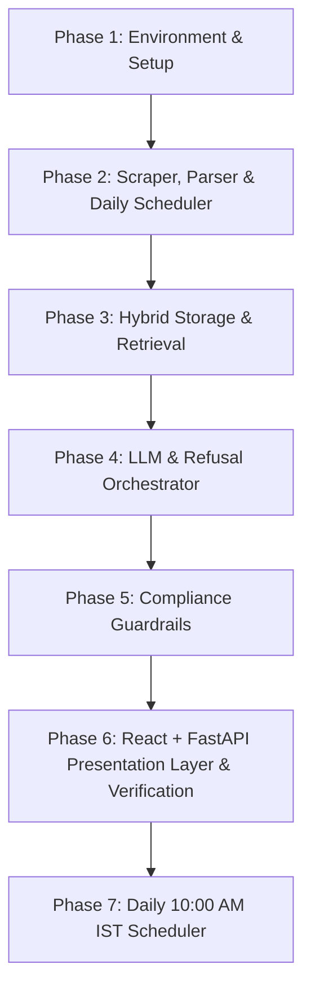

# Phase-Wise Implementation Plan: Mutual Fund FAQ Assistant

This document outlines a step-by-step roadmap to implement the **Mutual Fund FAQ Assistant**. The plan is divided into 7 logical phases, starting from foundation setup to daily scheduled data ingestion.

---

## Milestone Checklist

Use this checklist to track development progress:
- [x] **M1:** Development environment configured, dependencies installed, and `.env` template set up.
- [x] **M2:** Web scraper & parser successfully extracting data from 5 Groww URLs and saving it to SQLite + Vector DB.
- [x] **M3:** Daily scheduler runs ingestion and refreshes data on a mock or local chron scheduling system.
- [x] **M4:** Hybrid search retrieval system returns relevant structured contexts and text chunks.
- [x] **M5:** Pre-processing query classifier and post-generation guardrails successfully block advisory terms and verify output length/links.
- [x] **M6:** React + FastAPI frontend completes end-to-end user testing.
- [/] **M7:** Ingestion scheduler executes precisely at 10:00 AM IST daily.

---

## 🛠️ Phases of Implementation

### Phase 1: Environment Setup & Foundation
**Goal:** Initialize the project repository, set up standard directory structure, configure python environment, and list core dependencies.
*   **Tasks:**
    1.  Initialize a virtual environment (`python -m venv .venv`).
    2.  Create directory structures:
        *   `src/data/` — Scrapers, parsers, database adapters.
        *   `src/services/` — Embeddings, RAG retrieval, LLM orchestration, guardrails.
        *   `src/app/` — Streamlit UI.
        *   `tests/` — Test suite.
    3.  Create `requirements.txt` containing:
        *   `beautifulsoup4` / `playwright` (web crawling)
        *   `sqlite3` (built-in relational database)
        *   `chromadb` or `faiss-cpu` (vector store)
        *   `sentence-transformers` (local text embedding generation)
        *   `groq` or `google-generativeai` (LLM completions)
        *   `streamlit` (frontend UI)
        *   `python-dotenv`, `pytest`, `pydantic`
    4.  Create `.env.example` defining API keys (`GROQ_API_KEY`, etc.) and system parameters.

---

### Phase 2: Web Scraper, Parser & Daily Scheduler
**Goal:** Build the data acquisition pipeline to fetch and process scheme facts from the 5 designated Groww URLs.
*   **Tasks:**
    1.  **Web Scraper**: Write a scraper using `BeautifulSoup` (or `Playwright` if pages are fully client-side rendered) to fetch the 5 HDFC Direct-Growth scheme pages.
    2.  **Information Parser**: Extract target attributes:
        *   *Structured:* Expense Ratio, Exit Load, Minimum SIP, Riskometer classification, Benchmark index, NAV, and Launch date.
        *   *Fund Management Details:* Manager names, tenure, and background narrative.
    3.  **Daily Scheduler**: Implement a scheduling script (e.g., using `APScheduler` or a cron task command runner) that triggers the scraper daily at a set time (e.g., 23:00) to pull updated NAV values and details.

---

### Phase 3: Hybrid Storage & Retrieval
**Goal:** Persist the scraped data and build the search mechanism to fetch accurate contexts for incoming queries.
*   **Tasks:**
    1.  **SQLite Adapter**: Build a database script that schema-maps the structured facts and writes/updates records.
    2.  **Vector Ingestion**: Create a text chunker implementing a **hybrid entity-based chunking strategy**:
        *   *Structured summaries* (1 chunk/scheme) containing NAV, expense ratio, exit load, benchmark, and managers list.
        *   *Manager bios* (1 chunk/manager/scheme) containing name, education, experience narrative, and tenure.
        *   *Category disclosures* (1 chunk/scheme) containing taxation and category helpers.
        Compute embeddings using a lightweight model (`BAAI/bge-small-en-v1.5` with the query prefix `"Represent this sentence for searching relevant passages: "`) and load them into a local vector store (**ChromaDB**).
    3.  **Hybrid Retrieval Router**: Write a service to determine query routing:
        *   If search matches direct parameters (e.g., *"minimum SIP amount"*), fetch from SQLite.
        *   If search is semantic (e.g., *"fund manager background"*), query vector store.
    4.  **Context Aggregator**: Package retrieved chunks with metadata, including the correct Groww source URL and extraction timestamp.

---

### Phase 4: LLM Generation & Refusal Orchestration
**Goal:** Connect to the Groq LLM (with Gemini/mock as fallbacks) and construct prompts that answer queries using *only* retrieved context using our hybrid routing strategy.
*   **Tasks:**
    1.  **LLM Provider Integration**: Build a reusable LLM client wrapper configured to use Groq for completions, with fallback configurations (Gemini / mock / DB fallback).
    2.  **System Prompt Design**: Construct a strict system prompt instructing the model to stay factual, restrict responses to 3 sentences, and append exactly one citation link.
    3.  **Refusal Engine**: Build a pre-retrieval routing system. If a query contains advisory keywords (*should I, best, buy, sell, recommend*), bypass the LLM and return a polite refusal with an educational link. If a query is out-of-scope (doesn't target any of the 5 HDFC schemes or has low vector similarity), return a standard out-of-scope refusal.

---

### Phase 5: Compliance Guardrails (Post-Processing)
**Goal:** Enforce strict compliance rules before displaying responses to the user, using **Groq** for any secondary compliance repair calls.
*   **Tasks:**
    1.  **Sentence Length Guard**: Validate that the generated LLM text does not exceed 3 sentences. If it does, trigger a self-correction repair call via **Groq** or programmatically truncate it.
    2.  **Citation Link Validator**: Parse the output to ensure it contains exactly **one** URL link and that it matches one of the 5 allowed Groww URLs.
    3.  **Advisory Term Auditor**: Scan the LLM output for advisory keywords (e.g., *"highly recommend"*, *"better return"*, *"you should invest"*).
    4.  **Verification Fallback**: Implement a fallback mechanism: if any constraint check fails twice after the **Groq** self-correction loop, reject the output and display a predefined factual fallback message from the SQLite card.

---

### Phase 6: React + FastAPI Presentation Layer & Verification
**Goal:** Assemble the system into a user-friendly, responsive chat dashboard using a browser-compiled React UI served via FastAPI, and perform validation.
*   **Tasks:**
    1.  **FastAPI Server**: Create `src/app/main.py` serving static React client and exposing chat query endpoints.
    2.  **React Frontend Client**: Create `src/app/index.html` loading React, Babel, and Tailwind CSS. Design a Stitch-inspired glassmorphic chat UI with:
        *   Teal-accented Groww-inspired theme with mesh gradient backgrounds.
        *   Prominent header disclaimer: `⚠️ Facts-Only Assistant. No investment advice.`
        *   Quick-click suggestion cards for schemes and common queries (NAV, Managers, Expense Ratio).
        *   A stateful chat log rendering user questions and assistant answers (including citation link buttons and source update date footers).
    3.  **Integration Testing**: Run the full `pytest` suite verifying scraper, db, search, compliance engine, and orchestrator.

---

### Phase 7: Daily 10:00 AM IST Scheduler
**Goal:** Align the backend data ingestion script to run automatically at 10:00 AM IST every day.
*   **Tasks:**
    1.  **Delay Calculation**: Modify `src/data/scheduler.py` to dynamically compute the time difference between the current local time and 10:00 AM.
    2.  **Scheduler Loop**: Use `time.sleep` to block execution until 10:00 AM is reached, then run `run_ingestion()`. After completion, recalculate the next day's 10:00 AM timestamp.
